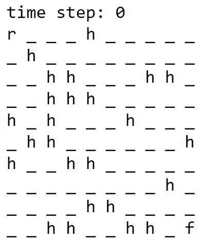
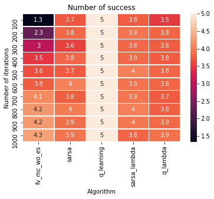
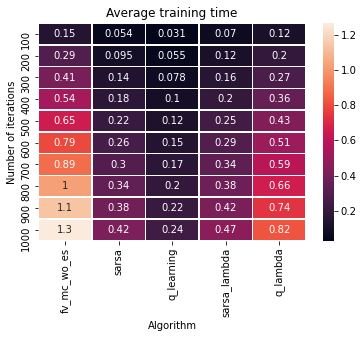

# Frozen Lake Reinforcement Learning
In this repository, the objective is to utilise reinforcement learning techniques to solve the Frozen Lake Problem, where a robot is tasked to move from the top left corner of any N X M grid world to the the bottom right of the grid world while avoiding any holes along the way. There is a guaranteed solution to the problem for any randomly generated grid world. An illustration is provided below of a 10 X 10 grid world, where **r** represents the robot, **h** represents a hole to be avoided by the robot and **f** represents the finishing point. 

## Reinforcement Learning Techniques

The code utilises the following tabular reinforcement learning techniques: 

1. First Visit Monte Carlo without Exploring Starts
2. SARSA
3. SARSA($\lambda$)
4. Q Learning
5. Watkin's Q($\lambda$) 

The details of the stated reinforcement learning techniques is elaborated in [frozen_lake_rl_report](https://github.com/mion666459/frozen_lake_rl/blob/main/frozen_lake_rl_report.pdf).  The following plots shows some of the results in comparing the various algorithms in a 4 X 4 grid world. Comparing the number of success (maximum 5) and training time between the number of iterations and the type of the algorithm, the following illustrations are obtained.

    
    

​    

   
